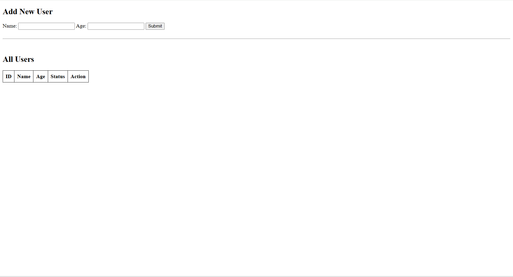
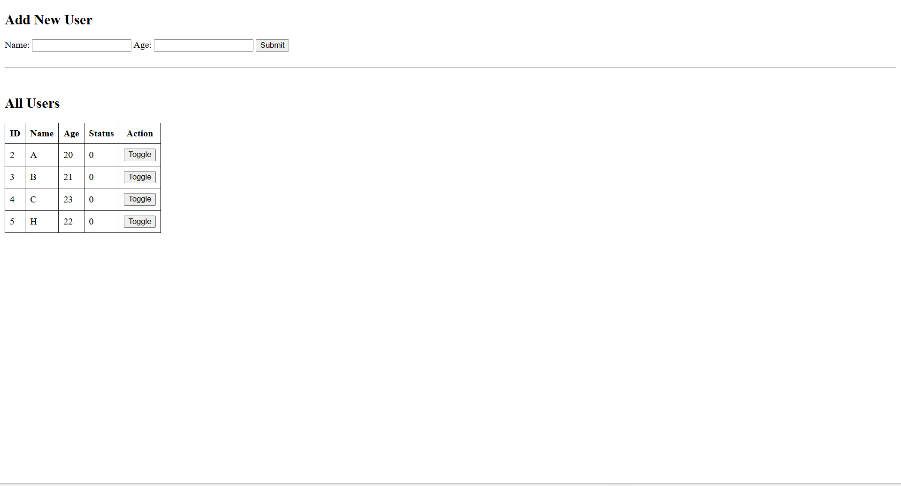
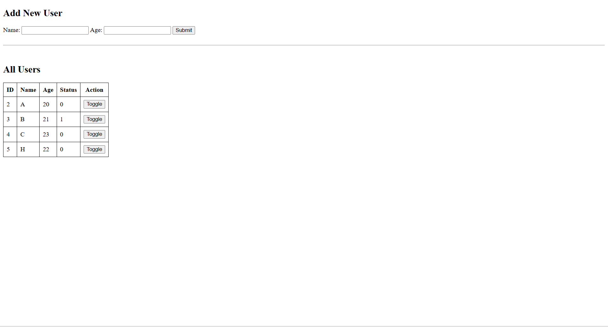
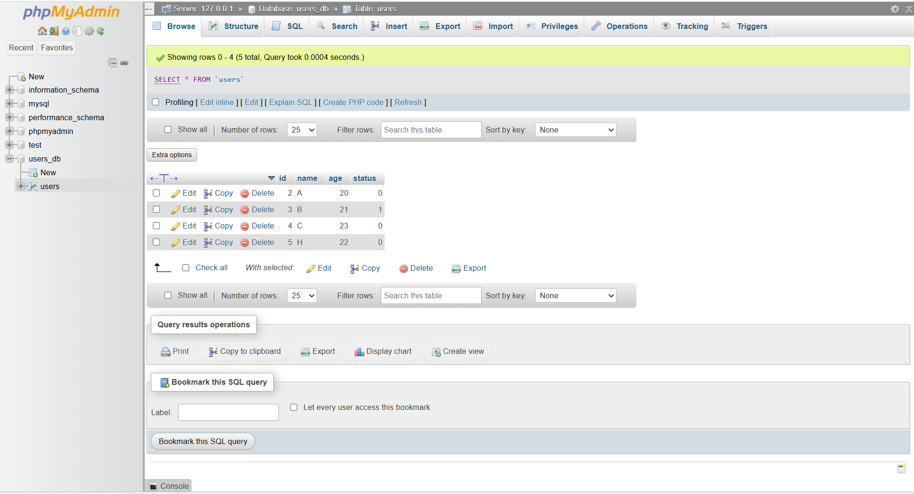

# User Form Project
 
Simple PHP web app where users can submit their name and age. Data is saved in MySQL and displayed in a table. Each record has a toggle button to change status between 0 and 1.

## How to Run Locally

1. Start Apache & MySQL from XAMPP
2. Import users_db.sql into phpMyAdmin
3. Place the folder inside C:\xampp\htdocs\
4. Open in browser: http://localhost/user-form/

## Screenshots

### Form

### Table

### Toggle Status

### Database (phpMyAdmin)

